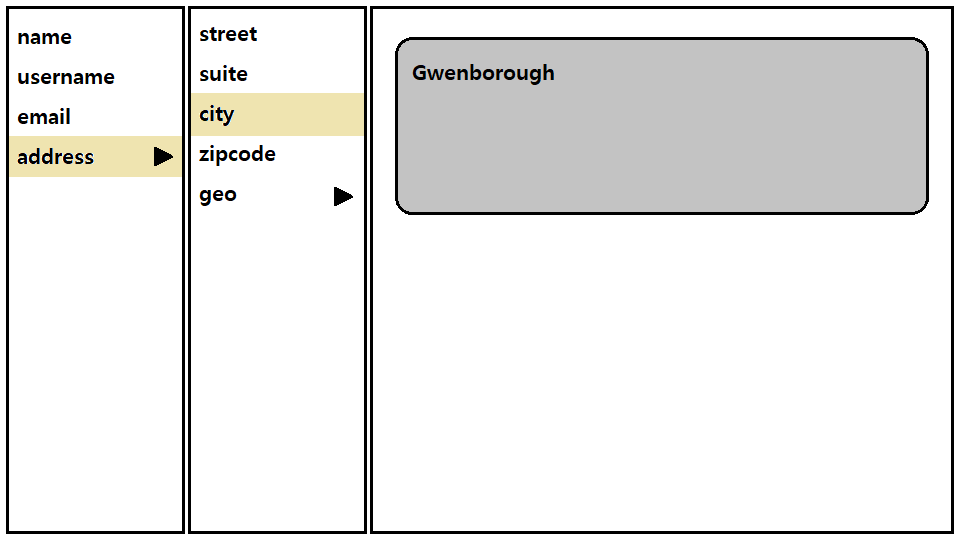
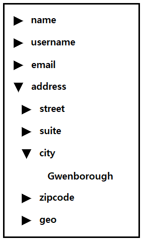

# JSON navigator

## 기한

- 과제 수령일로부터 1주일 이내

## 제출 방법

- GitHub 비공개 저장소에 작업하여, collaborator로 `dev.account@fastfive.co.kr` 를 초대

## 과제 설명

- JSON의 구조를 시각적으로 렌더링하는 페이지 개발

## 전제 조건

- 프레임워크나 라이브러리는 자유롭게 사용할 수 있다.
- JSON 파일의 각 property 이름은 영어 대소문자(`[a-zA-Z]`), 숫자(`[0-9]`), 마침표(`.`)로 구성될 수 있다.
  - 단, property 이름의 처음과 끝에는 마침표가 올 수 없고, 마침표가 둘 이상 연속하는 경우는 없다고 가정한다.

## 요구 사항

- 브라우저에서 파일을 첨부할 수 있어야 한다.
  - 단, JSON 유형의 파일만 선택할 수 있어야 한다.
  - 실제로 파일이 어딘가에 업로드 될 필요는 없다.
- JSON 파일의 각 property 이름은, 마침표(`.`)를 구분자로 하여 계층 관계로 표현되어야 한다.
  - 하나의 JSON 파일에 최상위 계층 요소가 둘 이상 존재할 수 있다.
- 하위 계층이 존재하는 요소를 선택하면, 그 요소의 바로 다음 계층에 포함되는 요소들이 렌더링 되어야 한다.
  - 이미 렌더링 된 계층 관계가 있더라도, 마지막으로 선택한 요소의 다음 계층까지만 렌더링 되어야 한다.
- 하위 계층이 존재하지 않는 마지막 계층의 요소를 선택하면, 원래의 property 이름에 대응되는 value가 렌더링 되어야 한다.
- 가로보기와 세로보기를 전환할 수 있어야 한다. (아래의 화면 예시 참고)
- 개발 결과물을 확인하는 방법이 `README.md`에 문서화 되어있어야 한다.

## 화면 예시

```json
{
  "name": "Leanne Graham",
  "username": "Bret",
  "email": "Sincere@april.biz",
  "address.street": "Kulas Light",
  "address.suite": "Apt. 556",
  "address.city": "Gwenborough",
  "address.zipcode": "92998-3874",
  "address.geo.lat": -37.3159,
  "address.geo.lng": 81.1496
}
```

- 가로보기

  

- 세로보기

  
